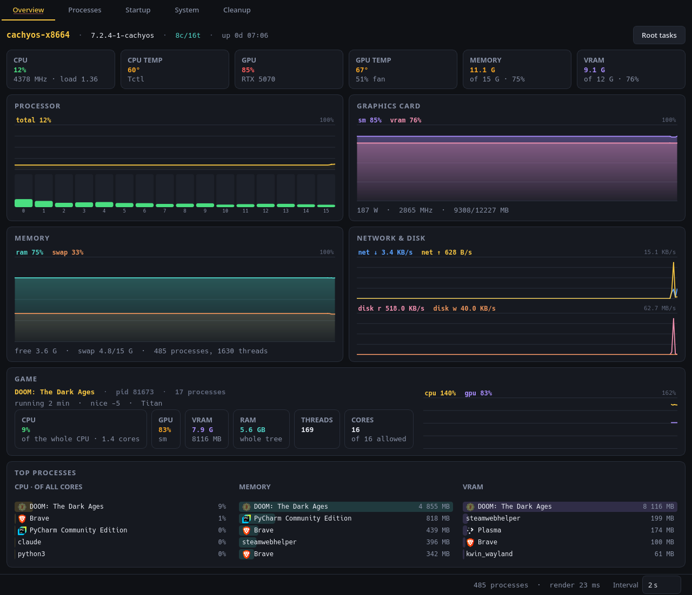
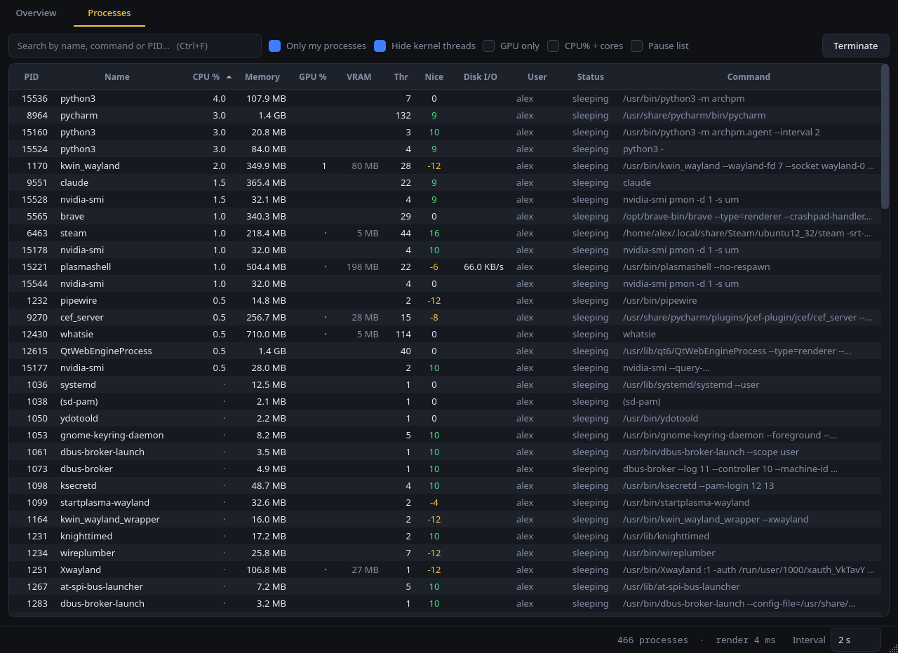
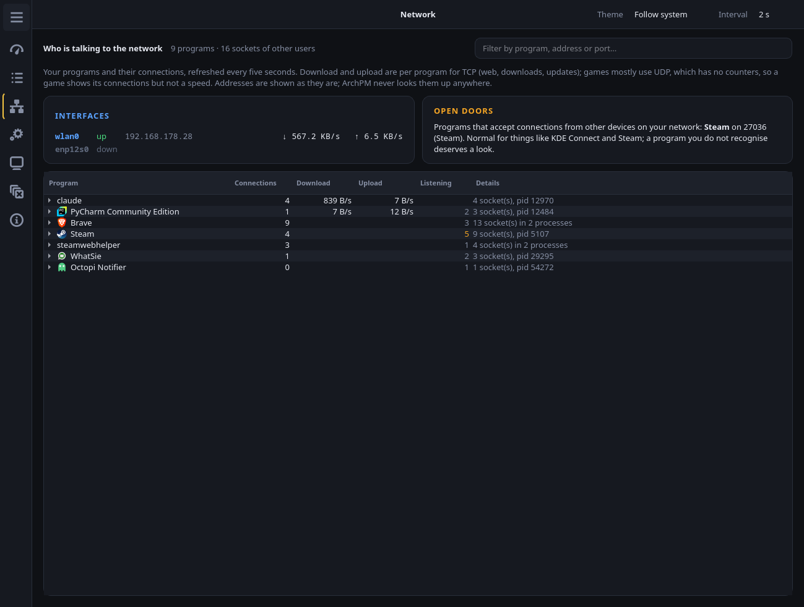
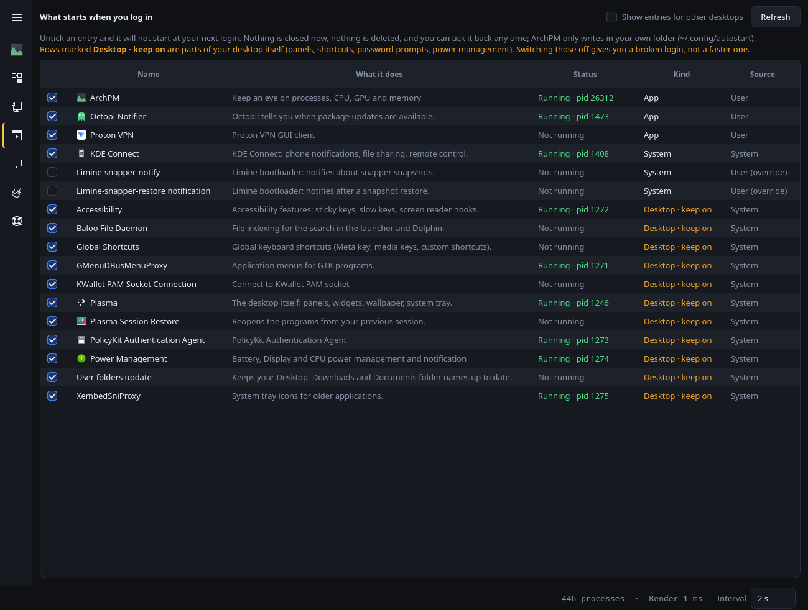
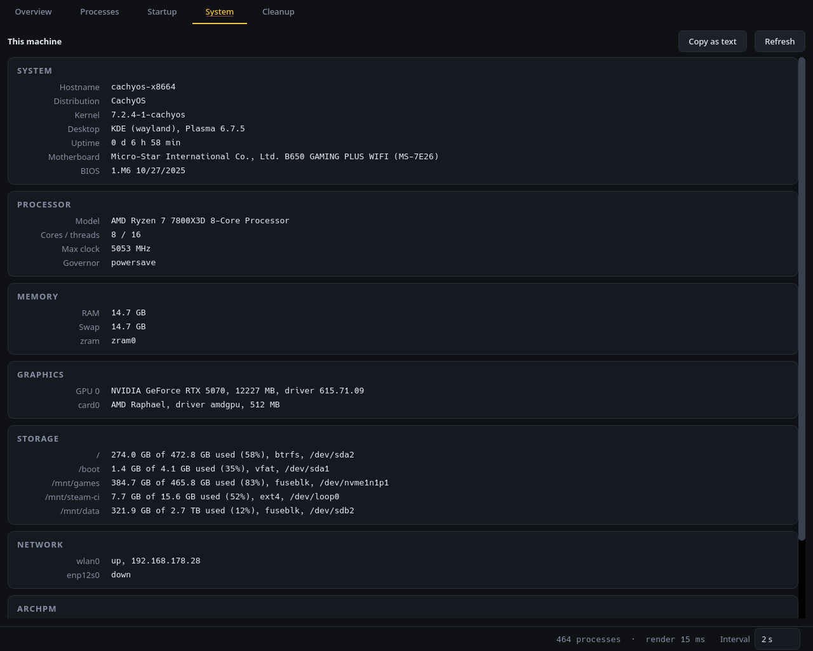
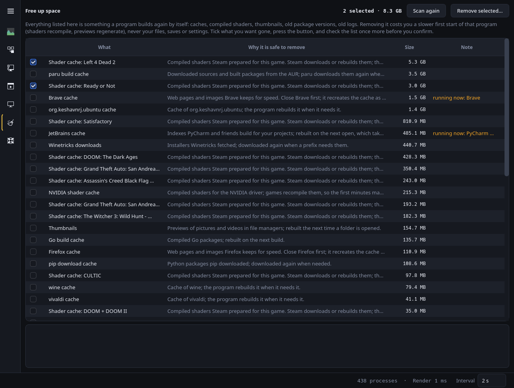
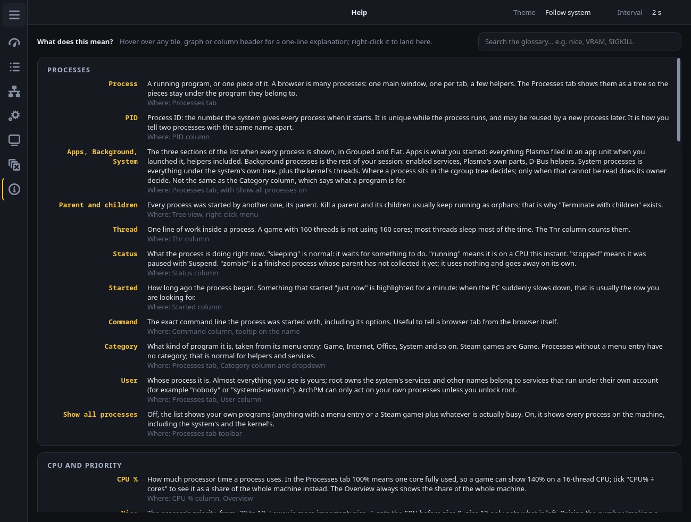
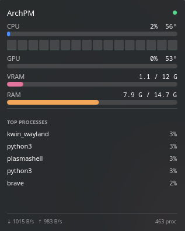
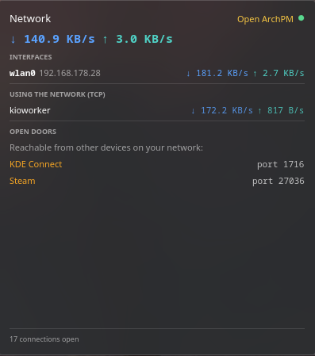

# ArchPM

> **Built with AI, in the open.** This project was written with Claude (via Claude
> Code), from the first line of code to this README. I set the direction, decided
> what goes in and what stays out, and tested everything on my own machine; the
> AI wrote most of the code. I'm saying so up front because you deserve to know
> that when you read a root helper written by someone else. About me: three years
> on Linux, almost a year on CachyOS. Not an expert in Linux or Arch, but not a
> beginner either. Read the code, and `SECURITY.md`, with that in mind.

ArchPM is a task manager for gamers and newcomers on Arch-based distros. When I
moved to CachyOS I went looking for a process manager that made sense to me and
couldn't find one, so after a year on the distro I started building one myself
with Claude Code.

A task manager that explains itself: whether anything is straining the machine
and which program, what is running, what it costs, who is using the network,
what starts at login, and what can be cleaned up, in plain words. Three parts
that share the same measurement core:

| Component | What it is |
|---|---|
| **GUI** ("ArchPM" in your application menu) | the window: Overview, Processes, Network, Startup, System, Cleanup, Snapshots and Help, reached from a rail of icons on the left that widens when you hover it and pins open with its menu button. A header bar above the page carries the page's name, the theme (light, dark, or the system's, which is the default) and the sampling interval (0.5, 1, 2 or 5 seconds; 2 is the default) |
| **Agent** (`archpm-agent`) | a background service that samples every 2 s and writes `status.json`. Measured on a 7800X3D over 3 h 19 min of ordinary desktop use, no game: 3.6% of one core in total, of which 2.7% is the sampler itself, 0.9% the `nvidia-smi pmon` helper that gives per-process GPU figures and 0.1% the `nvidia-smi` query loop for the card; the two helpers only exist on NVIDIA. One sample of the whole machine takes about 75 ms on that CPU |
| **Widgets** | two Plasma 6 plasmoids (Monitor, Network) that read `status.json`. They work while the window is open, because the window writes that file itself; the agent is what keeps them running with the window closed |

## Screenshots

**Overview**: one line at the top says in words whether anything is straining
the machine and which program; below it the tiles, CPU per core, GPU, memory,
network and disk, the game card, and the heaviest programs. Root tasks sits at
the foot of the page.



**Processes**: the Grouped view, one row per program with its real name and
icon, a browser folded to one row with its real memory use and its number of
processes, and the last minutes of whatever you select graphed underneath.
Right-click to terminate, pause, change its priority or choose the cores it
may use.



**Network**: which of your programs talk to the network, at what speed, to
which addresses, and which ones are "open doors" that other devices can reach.
A browser opens to one row per process that holds sockets, each with its
ports. Interfaces with a VPN mark, so you can see the tunnel carrying the
traffic.



**Startup**: what starts when you log in, in two groups, Enabled and Disabled,
with a switch per entry, what each one does, and whether it is running now.
Parts of the desktop are marked "keep on", and switching one off asks first
and says what you lose.



**System**: the failed services, if any, with their last log lines; then the
specs in groups, from motherboard and BIOS to disks and network, with "Copy as
text" for a forum post.



**Cleanup**: caches, shader caches, thumbnails, old package versions and old
logs, each with its size and why it is safe to remove. Nothing goes until you
tick, press and confirm.



**Snapshots**: what Snapper or Timeshift keeps, grouped by who took it (you,
pacman, a timer) with a count on each header, newest first; a pacman
transaction is one row that opens to its before and after. A button to take
one and one per snapshot to delete, never the last. Restoring stays with
the tool.

**Help**: a glossary in plain language, searched as you type, what the colours
mean, and About with the version and the changelog.



**Widgets**: two Plasma plasmoids, *ArchPM Monitor* (CPU, GPU, memory, game,
top processes) and *ArchPM Network* (download and upload, VPN, top talkers,
open doors). They work with the window open; the agent is what keeps them
running with the window closed.




## Status and support

Built for and tested on one machine: CachyOS (Arch), KDE Plasma 6 on Wayland,
an AMD Ryzen 7800X3D and an NVIDIA RTX 5070. It will probably work on any Arch
derivative with Plasma 6 and an NVIDIA card. AMD GPUs use a sysfs
fallback that has only been exercised on the Ryzen's integrated Radeon (which it
reports as "AMD Raphael", with temperature, power and clock). The Intel
per-process path (i915 and xe) is written from the kernel documentation and
has never run on Intel hardware; if it misbehaves on yours, please open an
issue with the output of `cat /proc/<pid>/fdinfo/*` for a process that uses
the GPU. Other desktops get the GUI but not the widgets.

This is a personal tool that I am sharing in case it is useful to you. There
is **no support**: if it does not work on your PC, I probably cannot help. Bug
reports and patches are welcome, but there is no promise that I will act on
them. The license is MIT, so feel free to fork it and make it your own.

See `SECURITY.md` for what the root helper does and does not protect against.

## Requirements

Arch Linux or a derivative (CachyOS, EndeavourOS, Manjaro). Package names below
are Arch's; on another distribution find the equivalents.

| For | Packages | Notes |
|---|---|---|
| GUI and agent | `python` (3.10+), `pyside6` (6.5+), `python-psutil` (5.9+) | the only hard requirements |
| Building the package | `git`, `base-devel` | `makepkg -s` fetches the rest (`python-build`, `python-installer`, `python-wheel`, `python-setuptools`) |
| Widgets | KDE Plasma 6 (`plasma-desktop`) | other desktops get the GUI but no widgets |
| Network page | `iproute2` | provides `ss`; part of every Arch install |
| Root tasks, Cleanup | `polkit` | provides `pkexec`; your user must be allowed to authenticate as admin (in Arch that is the `wheel` group) |
| Cleanup of the package cache | `pacman-contrib` | provides `paccache` |
| Snapshots page | `snapper` or `timeshift` | the page shows the one that is installed and says so when neither is; nothing is installed for you |
| NVIDIA telemetry | `nvidia-utils` | provides `nvidia-smi`; without it the GPU falls back to sysfs |
| AMD and Intel telemetry | nothing extra | the card from sysfs, per-process usage from DRM fdinfo; `hwdata` gives the card a proper name |
| Rail icons | `adwaita-icon-theme` (optional) | the Adwaita icons on the rail and for the kinds of entries; without it everything uses Breeze's |
| Agent as a service | a systemd user session | standard on any systemd desktop |

## Installing

**The package is ready and waiting for the AUR to reopen.** The AUR is closed
for new submissions at the time of writing, so it is not there yet and there
is no point looking for it. Build it yourself from the release tag; that is the
route this README expects, and it puts everything in its proper place: console
scripts in `/usr/bin`, the root helper in `/usr/lib/archpm`, the polkit policy,
a systemd user unit and both widgets.

```bash
git clone https://github.com/outing69/ArchPM.git && cd ArchPM
git checkout v0.2.38                 # a release tag, not the branch
cd packaging/aur && makepkg -si      # builds, runs the tests, installs with pacman
systemctl --user enable --now archpm-agent
```

`makepkg -si` asks for your password once, for pacman. The release tag is the
one the PKGBUILD's checksum matches; the branch moves on between releases.
Once the package is on the AUR, your AUR helper updates it like any other
package; until then, check out the next tag and run `makepkg -si` again.

Now open **ArchPM** from your application menu. The agent is running in the
background, so the widgets keep showing numbers when the window is closed.

**The widgets.** Right-click your desktop → *Add Widgets* → **ArchPM
Monitor** and, if you want it, **ArchPM Network**. Both can go in a panel too:
right-click the panel → *Add Widgets*. There they show a one-line strip
("CPU 12% · GPU 83% · RAM 51%", "↓ 1.2 MB/s  ↑ 88 KB/s") and open the full
view on click; in a vertical panel the Network strip stacks its two rates in
a short form ("↓1.2M" over "↑88K"), with the full rates in its tooltip.

For frame rates and usage *inside* a full-screen game, use MangoHud; ArchPM is
for before and after: what the game did to the machine, and what else runs.

### From a checkout, without the package

The install script puts everything in your home folder and runs the GUI and
the agent from the checkout, so you can follow the branch. The first line needs
no password: the agent as a user service, both widgets, the menu entry and a
shortcut on your desktop. The second asks for your password once: it installs
the small root helper that Root tasks and Cleanup use. You can skip it and add
it later, or do both in one go with `--all`.

```bash
git clone https://github.com/outing69/ArchPM.git && cd ArchPM
./install.sh          # agent, widgets, menu entry, desktop shortcut  (no root needed)
./install.sh --root   # the pkexec helper and the polkit policy (optional)
./install.sh --all    # both
```

To update a checkout install: pull, then run the script again. The GUI picks
up new code the next time it starts and the agent after a restart; the
widgets, the menu entry and the root helper are copies and need the script.

```bash
cd ArchPM && git pull
./install.sh            # agent, widgets, menu entry
./install.sh --root     # the root helper and polkit policy (asks for your password)
systemctl --user restart archpm-agent
```

If you switch from a checkout install to the package, remove the checkout
install first:

```bash
./install.sh --uninstall
```

pacman refuses to overwrite a file it does not own, and the polkit policy that
`install.sh --root` put in `/usr/share/polkit-1/actions` is such a file, so the
package will not install over it. The copies in your home folder (the user
unit, the widgets, the menu entry) would not block pacman, but they would
shadow the packaged ones. `--uninstall` removes all of it; your settings stay.

For the curious: the GUI and agent are also a regular Python package
(`pyproject.toml`, console scripts `archpm` and `archpm-agent`), so
`pipx install git+https://github.com/outing69/ArchPM` should work too. That
gives you the window and the sampler, but not the widgets, the systemd unit or
the root helper; those come from the package or `install.sh`. I have not run
that route myself.

## What it measures

- **The verdict**: one line at the top of the Overview, in words. "Nothing is
  straining the machine." is the normal state. Otherwise the program that is:
  "PyCharm is using 44% of the processor.", "Memory is nearly full: Brave holds
  8.0 GB.", "The processor is fully busy; the biggest user is X (12%)." or
  "The processor is running hot: 92°." A game at that share reads "that is the
  game". When a program is named the line is a link that opens Processes with
  that row selected. Computed from the same sample as everything else: memory
  above 85% of RAM, one program above a quarter of the whole processor, the
  whole processor above 85%, a part above 90°. A strain is named only when it
  holds for three samples in a row, so a page load does not flash a name.
- **CPU**: total, per logical core, frequency, load and temperature, with
  "normal", "warm" or "hot" on the tile (under 80°, to 90°, above). The
  per-core strip shows at most 64 bars in the GUI and 32 in the widget; bigger
  CPUs are shown as group averages (labelled "0-1", "2-3", …).
- **GPU**: load, video memory, temperature, power draw and clock speed, plus
  **per-process GPU usage** from the kernel's DRM fdinfo, which AMD (amdgpu)
  and Intel (i915, xe) export for every process without root or an extra
  package; the Intel side is untested, see above. NVIDIA's driver exports
  nothing there, so for an NVIDIA card the per-process numbers come from
  `nvidia-smi pmon` (works for games too, not just CUDA). Whole-card numbers
  for AMD still come from sysfs.
- **Processes**: CPU, memory, GPU, video memory, threads, priority, disk,
  start time and category per process. Three views: **Grouped** (the
  default), one row per program by its systemd unit, opened for its
  processes; **Tree**, every process under its parent (Steam → reaper →
  Proton → game); **Flat**, one row per process. Programs with a `.desktop`
  entry get their proper name, icon and category; Steam games get the game's
  name and Steam's icon for it; a process without an icon of its own shows
  the icon of its kind. A closed group carries its number of processes,
  "Brave (19)", and its totals, with shared memory counted once, so a browser
  reads as one row with its real memory use. Opened, a browser's processes
  are named for what they are, from their own command line: "Brave · page",
  "Brave · extension", "Brave · graphics", "Brave · network", "Brave ·
  helper"; the same for Chrome, Firefox, Electron applications and Steam's
  webhelper. By default you see your programs plus whatever is busy; "Show
  all processes" shows everything in three sections, Apps, Background
  processes and System processes, each header counting the rows under it.
- **Game**: a card on the Overview for whatever game is running: its whole
  process tree's CPU, GPU, video memory, RAM and threads, the cores it may use,
  and a graph of its last minutes. The card has its own verdict and its own
  colour rule: the graphics card fully used is the good outcome for a game, so
  "the game is the limit, as it should be" is green; the processor as the
  limit is amber; neither busy (a menu, a loading screen, a frame cap) is
  quiet; hot is red. Steam games are found by app id; anything else doing real
  GPU work qualifies too.
- **History**: select a process and the last minutes of its CPU, GPU and memory
  appear under the list; a closed program shows everything it started.
- **Network**: every five seconds, one `ss` call lists the sockets of your
  own processes: which program has which connections open, to which address
  and port (named from `/etc/services`, never looked up online), download and
  upload per program for TCP, throughput per interface with VPN tunnels
  marked, and the "open doors": programs listening on every address, which
  other devices on your network can reach. A program that holds sockets in
  several processes, like a browser, shows one row per process between the
  program and its sockets, with that process's ports summarised on the row.
  Games mostly use UDP, which the kernel does not count, so a game shows its
  connections but not a speed. No root, no packet capture, no DNS or location
  lookups.
- **Startup**: what starts when you log in (XDG autostart), in two groups,
  Enabled and Disabled, each with its count, a switch per entry and whether it
  is running now. Switching off a part of the desktop or a system entry asks
  first and names what you lose at the next login, in plain words ("the
  panel, the desktop and its widgets" for Plasma). Not a password: the entry
  lives in your own `~/.config/autostart`, which a text editor could change
  just as well, so a prompt would guard nothing. Switching off writes your own
  copy there; nothing outside your home is touched, and switching back on asks
  nothing. The services of your session that start at login are listed
  underneath, read-only.
- **System**: the failed services first, a snapshot taken when the window
  starts and again only when you press "Refresh failed services"; never on a
  timer, never on the sampling cycle, and nothing is started or stopped. Then
  the machine's specs in groups: CPU, memory, GPUs and drivers, motherboard,
  kernel, desktop, disks, network, and ArchPM itself, including where its
  status file is. "Copy as text" for forum posts.
- **Cleanup**: free up space: per-program caches, Steam shader caches,
  thumbnails, old package versions (the last two of each are kept) and old
  logs, each with its size and a plain reason why it is safe. The page
  explains itself on first open. The sizes are read without root; the two
  items that need root, the package cache and the system logs, ask for your
  password when you press "Remove selected" with one of them ticked, and a
  row with nothing to remove says so. Nothing is removed until you tick,
  press and confirm. Your files, saves and settings are never touched.
- **Snapshots**: the snapshots Snapper or Timeshift keeps, grouped by who
  took them with a count on each header: yours on top (from the page or by
  hand), then pacman's (snap-pac's pairs, or Timeshift's autosnap), then a
  timer's (Snapper's timeline, Timeshift's schedule), newest first inside
  each. A pacman pair is one row with the transaction's time, what pacman
  did, both numbers and the size the two hold together; a click opens it to
  the two snapshots underneath, each with its own Delete. Each row shows
  when it was taken, its description, and its size where the tool reports
  one (Snapper does only with btrfs quota on). Read when the page opens and on its button,
  never on a timer. Snapper answers a plain user only when its config names
  them in `ALLOW_USERS` or `ALLOW_GROUPS`, and Timeshift answers root only, so
  when the plain read is refused the page says so and "Read snapshots" reads
  through the root helper, with the password once and silence for the next
  few minutes. Taking a snapshot goes through the helper with a description
  reduced to letters, digits, space, dot, underscore and hyphen, at most 72;
  deleting one goes through the helper after a confirmation that says what is
  lost and what remains, whether it is the oldest or the newest, and how many
  are left; the last remaining snapshot is never deleted. No rollback:
  restoring changes what the machine boots, and the page names how it is done
  instead (Limine's boot menu and limine-snapper-restore, snapper rollback,
  or Timeshift). Without the root helper the page reads and shows no buttons.
- **Help**: a searchable glossary in plain language (what nice -5 means, what a
  PID is, SIGTERM versus SIGKILL, why root is asked), what the colours mean, and
  About with version, links and the changelog. The tiles, the graphs and the
  process list's column headers have a one-line tooltip with an "is this
  normal?" range where it helps; right-click one to open the term in Help.

## What you can do with it

Right-click in the process list, or use the Terminate button: **Terminate**
asks the program to quit; **Force kill** ends it at once; **Pause** and
**Resume**; **Priority**; **Disk priority**; and **Cores it may use**, with
presets for physical cores only (no SMT siblings) and each half. On a row with
children, "Terminate with everything it started" takes the whole tree down at
once, so a killed game does not leave its launcher behind.

Every one of these asks first, for a single process as for a group, and every
irreversible one ends with the same sentence: "This cannot be undone." After a
Terminate the process is watched; if it is still there after five seconds the
toast says so and offers one button, Force kill, so you are not sent hunting
through a menu. Nothing is forced by itself.

## Permissions

The app runs as your own user. In that mode you can only control your own
processes and only lower their priority. Everything that needs more sits behind
a single button, **Root tasks**, at the foot of the Overview.

That separation is the core of the design:

- `archpm/root/helper.py` is the **only** file that runs as root. It lives
  root-owned in `/usr/lib/archpm/archpm-helper` (`/usr/local/lib/…` when installed
  from a checkout; pkexec refuses a program that
  a regular user can modify), imports nothing from this project and never
  starts a shell.
- `polkit/io.github.outing69.archpm.policy` decides who may authenticate. With
  `auth_admin_keep` polkit asks for your password once and remembers it for
  about five minutes.
- `archpm/root/client.py` only builds the `pkexec` call and reads the JSON reply.
  The GUI never sees a password.
- The helper validates on its own: fixed subcommands, numeric bounds, a fixed
  character set for a snapshot's description, and a list of units whose
  processes it refuses to signal, whatever the caller says: dbus, logind,
  journald, udevd, polkit, oomd and the display manager. It does not manage
  services at all, and it never restores a snapshot.

`ElevatedBackend` tries every action without privileges first. Only when that
is denied does it go through the helper, so you never get a password prompt
for something you were already allowed to do.

### What the root panel contains

| Group | Actions |
|---|---|
| Processes | raising priority, realtime disk priority, acting on other users' processes |
| Your session's services | start/stop/restart the services of your own login session, through `systemctl --user` as you: no root involved |
| Memory | swappiness, drop caches |
| Cleanup | `paccache -rk2` and `journalctl --vacuum-size=100M`, fixed, no arguments |
| Snapshots | `snapper list`, `snapper create` and `snapper delete` (or Timeshift's `--list`, `--create`, `--delete`), with a config name checked against `snapper list-configs`, a snapshot number that must exist, a description from a fixed character set, and a refusal to delete the last snapshot; never `rollback` or `--restore` |

**System services are deliberately left out.** The helper no longer manages
services at all. ArchPM only starts, stops and restarts the services of your
own login session, which needs no password, and it refuses to stop the ones
your desktop itself runs on (plasmashell, kwin, the session manager, the
session bus, pipewire, wireplumber, the desktop portal). System-wide services
are not touched.

**GPU tuning is deliberately left out.** Power limit, clock cap and persistence
mode used to be here and were removed: it is not process management. The helper
no longer knows those commands, so not via the command line either.

The GPU is still fully *measured*, including per-process video memory and load.
Just not adjusted.

## Architecture

```
archpm/sampler.py   psutil sampling; keeps Process objects between ticks
   ↑ gpu.py      DRM fdinfo per process; two long-running nvidia-smi processes (stats + pmon)
   ↓
   ├─ ui/worker.py  QThread → signals → dashboard.py / procview.py
   └─ agent.py      → publisher.py → $XDG_RUNTIME_DIR/archpm/status.json
                                     ~/.cache/archpm/status.json (symlink)
                                        ↑ plasmoid reads here
```

The GUI and the agent sample independently of each other. While the window is
open and the agent service is not running, the window writes `status.json`
itself, so the widgets work either way; when both run, the agent is the only
writer. The agent is what keeps the widgets running with the window closed.

The widget reads that JSON through the `executable` data engine (`cat`), not
through `XMLHttpRequest`: Qt 6 blocks XHR on `file://` unless
`QML_XHR_ALLOW_FILE_READ` is set, and that is an environment variable for all of
plasmashell. The file is data only: the widgets run nothing that comes out of
it. "Open ArchPM" uses a command fixed at install time, and "End game" asks
the window, which confirms and runs its signal guard as for its own button.
The file's directory is opened first and checked on the descriptor (ours, not
a symlink, not writable by others) before anything is written through it; see
SECURITY.md.

Root runs alongside the measurement chain, not through it:

```
archpm/ui/rootpanel.py ─ pkexec ─→ /usr/lib/archpm/archpm-helper   (root)
        │                            ↑ polkit: io.github.outing69.archpm.helper.run
        └─ ElevatedBackend ──────────┘   (only on AccessDenied)
```

## Useful commands

```bash
systemctl --user status archpm-agent        # is the agent running?
systemctl --user restart archpm-agent
python3 -m archpm.agent --once              # one sample to stdout (from a checkout)
archpm-agent --once                         # the same, installed as a package
journalctl --user -u archpm-agent -n 20     # the last log lines (-f to follow)
kpackagetool6 -t Plasma/Applet -u plasmoid/package   # update the Monitor widget (checkout install)
kpackagetool6 -t Plasma/Applet -u plasmoid/network   # update the Network widget
/usr/local/lib/archpm/archpm-helper status           # test the helper without root (checkout install)
/usr/lib/archpm/archpm-helper status                 # the same, installed as a package
pkaction --action-id io.github.outing69.archpm.helper.run --verbose    # inspect the polkit rules
./install.sh --uninstall-root                        # remove the root part of a checkout install
./install.sh --uninstall                             # remove everything install.sh installed
```

After changing a widget: `kpackagetool6 ... -u` and then
`systemctl --user restart plasma-plasmashell` (or `kquitapp6 plasmashell &&
plasmashell &`) to reload it.
